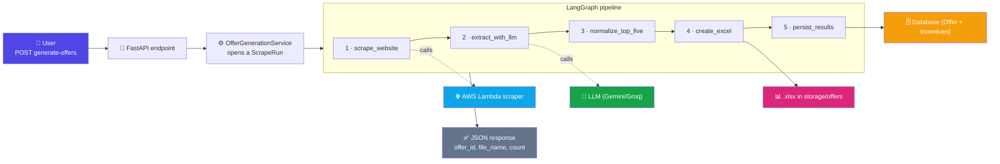
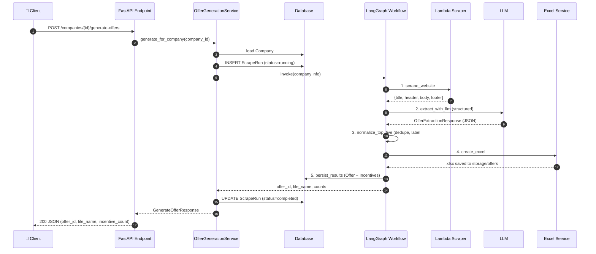
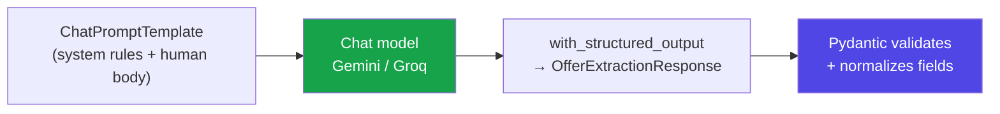
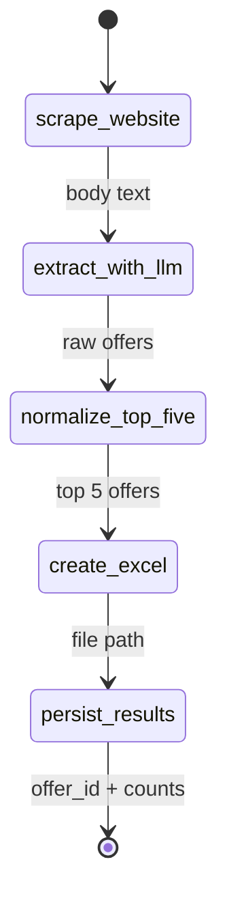
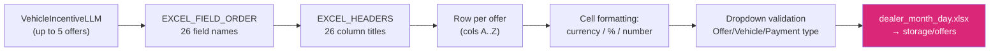
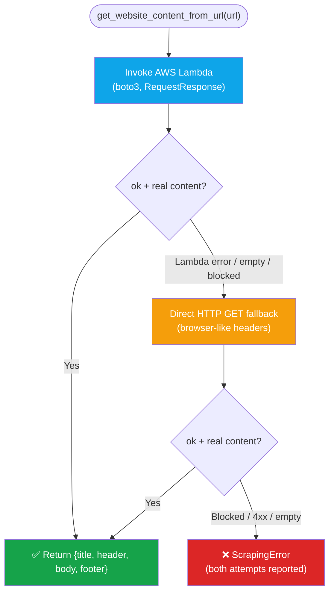
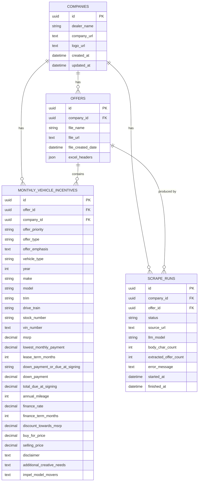

# Vehicle Offer Extraction API — Demo & Walkthrough

A FastAPI service that turns a car dealer's website into a structured, ready-to-use
Excel sheet of vehicle offers. It **scrapes** the dealer page (in an AWS Lambda), sends
the visible text to an **LLM** for structured extraction, keeps the top 5 offers,
generates a formatted **.xlsx** file, and saves everything to the database.

**One line:** *Give it a dealer URL → get back the top 5 vehicle offers as clean data + an Excel file.*

| Layer | Technology |
|-------|-----------|
| API framework | FastAPI + Uvicorn |
| Orchestration | LangGraph (state-machine workflow) |
| LLM plumbing | LangChain (`langchain-openai`, `langchain-groq`) |
| LLM | Gemini `gemini-3.5-flash-lite` (default) · Groq `llama-3.3-70b-versatile` |
| Scraping | AWS Lambda container (Playwright + Chromium) → direct HTTP fallback |
| HTML parsing | BeautifulSoup |
| Database | SQLAlchemy 2.0 ORM (SQLite by default, MySQL in prod), **UUID** keys |
| Excel | openpyxl |
| Validation | Pydantic v2 |
| Observability | Logfire |

---

## 1. Flowchart — How the App Works

The whole system in one picture: a request comes in, a LangGraph workflow runs five steps,
and the client gets structured JSON plus an Excel file on disk.

**Detailed request flow** for `POST /api/v1/companies/{company_id}/generate-offers`:

If any step throws, the `ScrapeRun` is marked `failed` with the error message and the API
returns a consistent error envelope (`{ "error": { "code": "...", "message": "..." } }`).

---

## 2. LLM Model Info

The extraction model is **pluggable** via `settings.llm_provider` in `app/core/config.py`.

| | Default (Gemini) | Alternative (Groq) |
|---|---|---|
| Provider | `gemini` | `groq` |
| Model | `gemini-3.5-flash-lite` | `llama-3.3-70b-versatile` |
| Client | `ChatOpenAI` (Gemini's OpenAI-compatible endpoint) | `ChatGroq` |
| Structured output | `method="json_mode"` | `method="function_calling"` |
| Temperature | `0` (deterministic) | `0` |
| Timeout / retries | 120s · 2 retries | 120s · 2 retries |
| Max tokens | 8000 (avoids mid-JSON truncation) | provider default |

**How the model is driven** (`app/services/llm_extractor.py`):
- **Structured output** — `model.with_structured_output(OfferExtractionResponse, include_raw=True)`
  forces the model to return JSON matching the Pydantic schema instead of free-form text.
- **Strict system prompt** — 14 numbered rules: extract every *distinct* offer, collapse the
  same offer repeated across banner/card/modal/disclaimer, return at most **5** ranked by
  customer value, **never invent values** (return `null` if not stated), and use a controlled
  vocabulary for `Offer Type` and `Vehicle Type`.
- **Field normalization** — Pydantic validators clean the raw output:
  - `"$3,998"` → `3998.0`  ·  `"1.9%"` → `1.9`  ·  `"36 months"` → `36`
  - Junk like `"N/A"`, `"unknown"`, `"-"` → `None`
  - Enum aliasing: `"certified pre-owned"` → `CPO`, `"lease"` → `Lease Offer`

> **Why `float` for money?** Some providers' tool-schema validators reject the regex Pydantic
> emits for `Decimal`, so money fields are typed as `float` in the LLM schema but stored as
> `Numeric(14,2)` in the database.

---

## 3. How LangChain and LangGraph Work Here

**LangChain** builds the *prompt → model* chain. **LangGraph** builds the *state machine*
that runs the whole pipeline. They stack: one LangGraph node calls the LangChain chain.

### LangChain (inside the `extract_with_llm` node)

The chain is literally `self.prompt | self.structured_model` — LangChain's pipe operator wires
the templated prompt into the structured model so one call returns a validated Python object.

### LangGraph (the workflow, `app/workflows/offer_generation_graph.py`)

A `StateGraph` with a shared `OfferWorkflowState` (a `TypedDict`). Each node reads keys from
the state and returns the keys it adds; edges run the nodes strictly in order.

| Node | Reads | Writes |
|------|-------|--------|
| `scrape_website` | `company_url` | `body`, `body_char_count` |
| `extract_with_llm` | `body` | `extraction` |
| `normalize_top_five` | `extraction` | `incentives`, `incentive_count` |
| `create_excel` | `dealer_name`, `incentives` | `file_name`, `file_path` |
| `persist_results` | `incentives`, `file_name` | `offer_id`, `file_url` |

`normalize_top_five` also **de-duplicates**: dealer pages echo the same offer across a hero
banner, an offer card, a "See details" modal, and its disclaimer, so it collapses copies that
share any VIN, stock number, or vehicle+terms signature, then keeps the first 5 and relabels
them `Vehicle #1..#5`.

---

## 4. How the Response Is Formatted to the Excel Template

`app/services/excel_service.py` maps each extracted offer to a fixed 26-column template
defined in `app/core/constants.py`.

**How the mapping works:**
- **Column order** — `EXCEL_FIELD_ORDER` lists the 26 schema field names; `EXCEL_HEADERS` lists
  the 26 human titles in the same order. Row 1 is the styled header (dark-blue fill, white bold,
  frozen, auto-filter). Each offer becomes one row starting at row 2.
- **Value coercion** — `Decimal` → `float`, enums → their `.value`, `None` → blank cell.
- **Number formats** — currency columns (MSRP, payments, due-at-signing, discount, buy-for,
  selling) use `$#,##0.00`; annual mileage uses `#,##0`; finance rate uses `0.0%`.
- **Dropdowns** — data-validation lists for `Offer Type` (7 options), `Vehicle Type` (4
  options), and `Down Payment / Due at Signing` (2 options) keep the sheet editable but valid.
- **Source trace** — the source URL is attached as a cell comment on `A1`.
- **File name** — slugified dealer name + local date, e.g.
  `norm_reeves_honda_august_11_tuesday.xlsx`; collisions get a `_2`, `_3` suffix.

The 26 columns: Offer Priority · Offer Type · Bonus/Starburst/Emphasis · Vehicle Type · Year ·
Make · Model · Trim · Drive Train · Stock Number · VIN Number · MSRP · Lowest Monthly Payment ·
Lease Term/Months · Down Payment or Due at Signing · Down Payment · Total Due at Signing ·
Annual Mileage · Finance Rate · Finance Term/Months · Discount Towards MSRP · Buy For Price ·
Selling Price · Disclaimer · Additional Creative Needs · Impel Model Movers.

---

## 5. How Scraping Works

Scraping is delegated to a dedicated **AWS Lambda container image** (`lambda_scraper/`) that
bundles Playwright + Chromium. The backend (`app/services/scraper.py`) invokes it and falls
back to a direct HTTP request if the Lambda fails or gets blocked.

**Inside the Lambda** (`lambda_scraper/handler.py` + `scraper.py`):
- Playwright loads the page in headless Chromium, runs JS, and waits for render.
- BeautifulSoup strips `<script>`, `<style>`, `<noscript>`, `<svg>`, then extracts the visible
  text of `<title>`, `<header>`, `<body>`, `<footer>`.
- Returns `{"ok": true, "content": {url, title, header, body, footer}}`; a bad page returns
  `{"ok": false, "error": "..."}` instead of crashing the container.

**Block detection** — both paths scan the body for anti-bot/maintenance markers
(`"just a moment"`, `"checking your browser"`, `"access denied"`, `"site currently not available"`,
etc.). A blocked page raises `ScrapingError` rather than feeding a fake page to the LLM.

**Why a fallback?** Some dealer sites block the Lambda's datacenter IP but serve the real page
to the backend's IP, so the direct HTTP GET often succeeds where the Lambda was blocked.

> **Health check tip:** because the fallback can mask a dead Lambda, test the Lambda in
> isolation with `aws lambda invoke --function-name vehicle_offer_scraper --region ap-south-2 ...`
> rather than relying on "offers still generate".

---

## 6. Every Database Model (Flowchart)

Four tables, all with **UUID** primary and foreign keys (SQLAlchemy `Uuid` type).

| Table | Purpose |
|-------|---------|
| **companies** | The dealer. Created first with a name + website URL (`app/models/company.py`). |
| **offers** | One generated batch / Excel file for a company — the "run result" (`app/models/offer.py`). |
| **monthly_vehicle_incentives** | The extracted rows, one per vehicle offer (up to 5) (`app/models/monthly_vehicle_incentive.py`). |
| **scrape_runs** | Audit log of each attempt: status, model, char/offer counts, error, timing (`app/models/scrape_run.py`). |

**Relationships & cascades:**
- A `Company` has many `offers`, `incentives`, and `scrape_runs` (all `cascade="all, delete-orphan"`).
- An `Offer` has many `incentives` (delete-cascade) and many `scrape_runs` (FK `ON DELETE SET NULL`,
  so deleting an offer keeps its audit rows).
- Every incentive links back to both its `offer` and its `company`.

> **Why UUIDs?** Non-guessable IDs, safe to expose in URLs, and no collisions when merging data
> across environments. They are generated in Python via `uuid.uuid4()` before insert.
