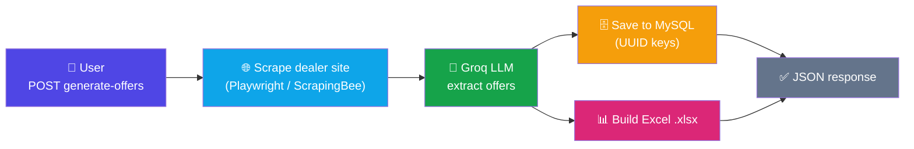
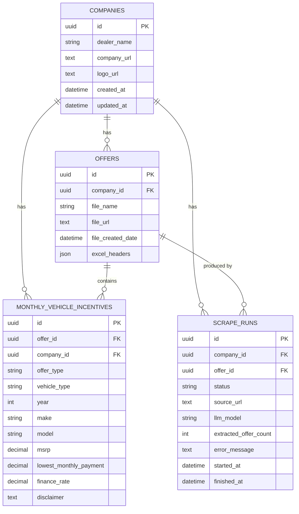
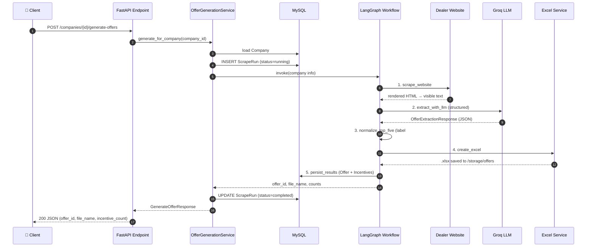
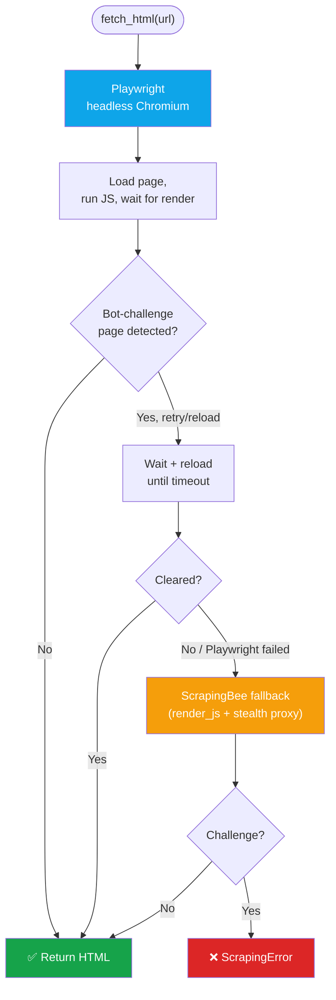
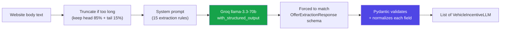
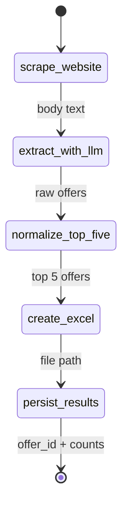

# Vehicle Offer Extraction API — Demo & Walkthrough

A FastAPI service that turns a car dealer's website into a structured, ready-to-use
Excel sheet of vehicle offers. It **scrapes** the dealer page, sends the visible text
to a **Groq LLM** for structured extraction, saves the top 5 offers to a **MySQL**
database, and generates a formatted **.xlsx** file.

---

## 1. The Big Picture (30-second pitch)



**One line:** *Give it a dealer URL → get back the top 5 vehicle offers as clean data + an Excel file.*

---

## 2. Tech Stack

| Layer | Technology |
|-------|-----------|
| API framework | FastAPI + Uvicorn |
| Orchestration | LangGraph (state machine workflow) |
| LLM | Groq (`llama-3.3-70b-versatile`) via `langchain-groq` |
| Scraping | Playwright (headless Chromium) → ScrapingBee fallback |
| HTML parsing | BeautifulSoup |
| Database | MySQL (via SQLAlchemy 2.0 ORM, **UUID** primary keys) |
| Excel | openpyxl |
| Validation | Pydantic v2 |
| Observability | Logfire |

---

## 3. Database Design

Four tables. Every primary key and foreign key is a **UUID** (stored as `CHAR(32)` in MySQL).



### What each table means

| Table | Purpose |
|-------|---------|
| **companies** | The dealer. You create one first with a name + website URL. |
| **offers** | One generated batch/Excel file for a company (a "run result"). |
| **monthly_vehicle_incentives** | The actual rows — one per vehicle offer (up to 5). This is the extracted data. |
| **scrape_runs** | An audit log of each generation attempt: status (`running`/`completed`/`failed`), model used, counts, errors, timing. |

> **Why UUIDs?** Non-guessable IDs, safe to expose in URLs, and no collisions when merging data across environments. They are generated in Python via `uuid.uuid4()` before insert.

---

## 4. The End-to-End Flow

This is what happens on:
`POST /api/v1/companies/{company_id}/generate-offers`



If any step throws, the `ScrapeRun` is marked `failed` with the error message, and the
API returns a structured error (see §8).

---

## 5. How Content Comes From the Web

The scraper (`app/services/scraper.py`) is built to survive bot-protection (Cloudflare-style
"Just a moment…" pages).



**Anti-bot tricks used:**
- Real Chrome **user-agent** + realistic viewport & locale
- `--disable-blink-features=AutomationControlled`
- Hides `navigator.webdriver` via an init script
- Detects challenge pages by known text markers, waits and reloads

**Turning HTML into clean text** (`get_website_content_from_url`):
1. Parse HTML with BeautifulSoup
2. Strip `<script>`, `<style>`, `<noscript>`, `<svg>`
3. Pull the visible text of `<title>`, `<header>`, `<main>` (or `<body>`), `<footer>`
4. Return a dict with `body` = the main text handed to the LLM

---

## 6. How the LLM Extraction Works

The LLM turns messy website text into a strict, validated data structure.



**Key ideas:**
- **Structured output** — `with_structured_output(OfferExtractionResponse, method="function_calling")`
  forces the model to return JSON matching our Pydantic schema (no free-form text).
- **Strict rules** in the system prompt: keep website order, max 5 offers, never invent
  values (return `null` if unknown), controlled vocab for `Offer Type` / `Vehicle Type`, etc.
- **Field normalization** in Pydantic validators cleans the raw model output:
  - `"$3,998"` → `3998.0`  ·  `"1.9%"` → `1.9`  ·  `"36 months"` → `36`
  - Junk like `"N/A"`, `"unknown"`, `"-"` → `None`
  - Enum aliasing: `"certified pre-owned"` → `CPO`, `"lease"` → `Lease Offer`
  - Range sanity checks: year 1980–2100, lease term 1–120, mileage ≤ 100k

> **Note:** Money fields are typed as `float` (not `Decimal`) specifically because Groq's
> tool-schema validator rejects the regex pattern Pydantic emits for `Decimal`. Values are
> still stored as `Numeric(14,2)` in the DB.

---

## 7. The Workflow as a State Machine (LangGraph)

`app/workflows/offer_generation_graph.py` defines 5 nodes run in sequence. Each node
reads from and writes to a shared `OfferWorkflowState`.



| Node | Does |
|------|------|
| `scrape_website` | Fetch + clean website text |
| `extract_with_llm` | Groq structured extraction |
| `normalize_top_five` | Keep first 5, relabel `Vehicle #1..#5` |
| `create_excel` | Build the `.xlsx` (headers, dropdowns, formatting) |
| `persist_results` | Insert `Offer` + `MonthlyVehicleIncentive` rows |

The resulting Excel uses the 27 fixed columns in `app/core/constants.py` (`EXCEL_HEADERS`),
with data validation dropdowns for Offer Type / Vehicle Type / Payment Type.

---

## 8. API Endpoints

Base prefix: `/api/v1`

| Method | Path | Purpose |
|--------|------|---------|
| `POST` | `/companies` | Create a dealer (name + URL) |
| `GET` | `/companies` | List dealers |
| `GET` | `/companies/{company_id}` | Get one dealer |
| `POST` | `/companies/{company_id}/generate-offers` | **Run the full pipeline** |
| `GET` | `/companies/{company_id}/offers` | List generated offers for a dealer |
| `GET` | `/offers/{offer_id}` | Get one offer batch |
| `GET` | `/offers/{offer_id}/incentives` | Get the extracted vehicle rows |
| `GET` | `/offers/{offer_id}/row-count` | Count of extracted rows |
| `GET` | `/scrape-runs/{scrape_run_id}` | Audit record of a run |
| `GET` | `/health` | Health check |

---

## 9. Live Demo Script (copy-paste)

**Step 1 — Start the server**
```bash
uvicorn app.main:app --reload
```

**Step 2 — Create a company**
```bash
curl -X POST http://127.0.0.1:8000/api/v1/companies \
  -H "Content-Type: application/json" \
  -d '{"dealer_name":"Norm Reeves Honda","company_url":"https://www.example-dealer.com/specials"}'
```
Response contains a UUID `id`:
```json
{ "id": "06239f70-3df1-4333-8402-58e3816a758f", "dealer_name": "Norm Reeves Honda", "...": "..." }
```

**Step 3 — Generate offers (the main event)**
```bash
curl -X POST http://127.0.0.1:8000/api/v1/companies/06239f70-3df1-4333-8402-58e3816a758f/generate-offers
```
Response:
```json
{
  "scrape_run_id": "…",
  "offer_id": "…",
  "company_id": "06239f70-3df1-4333-8402-58e3816a758f",
  "file_name": "norm_reeves_honda_august_11_tuesday.xlsx",
  "incentive_count": 5
}
```
The `.xlsx` file lands in `storage/offers/`.

**Step 4 — Inspect the extracted rows**
```bash
curl http://127.0.0.1:8000/api/v1/offers/<offer_id>/incentives
```

> 💡 Prefer the interactive docs? Open **http://127.0.0.1:8000/docs** for a clickable Swagger UI.

---

## 10. Error Handling

All failures return a consistent JSON envelope, e.g.:
```json
{ "error": { "code": "llm_extraction_failed", "message": "…" } }
```

Common codes: `company_not_found`, `offer_not_found`, `scrape_run_not_found`,
`scraping_failed`, `llm_extraction_failed`, `excel_generation_failed`. Every attempt is
also recorded in `scrape_runs` with a `failed` status and the error text.

---

## 11. Talking Points (for presenting)

1. **Input:** just a dealer URL. **Output:** clean structured data + Excel. That's the value.
2. **Resilient scraping** — Playwright with anti-bot evasion, ScrapingBee as a safety net.
3. **Trustworthy AI** — structured output + strict prompt rules + Pydantic validation means
   the LLM can't return garbage or invent numbers.
4. **Auditable** — every run is logged in `scrape_runs`; nothing is a black box.
5. **Clean architecture** — endpoints → service → LangGraph workflow → (scraper / LLM /
   excel / DB), each with a single responsibility.
6. **Production-minded** — UUID keys, configurable via `.env`, Logfire observability,
   consistent error envelope.
